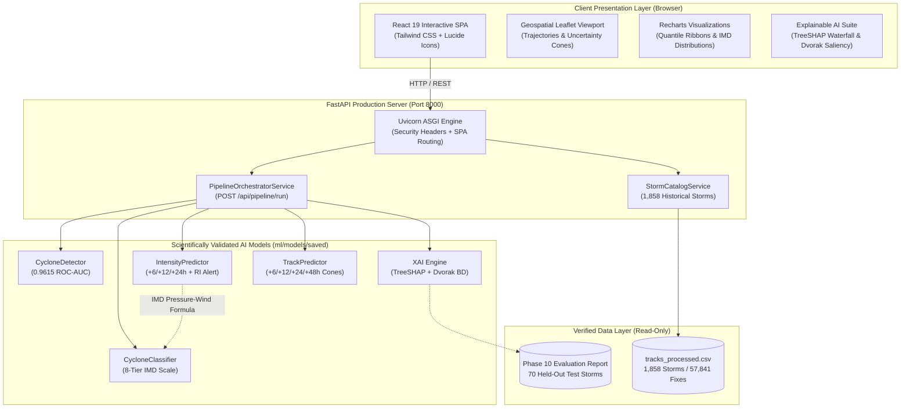

# CycloneAI: Intelligent Tropical Cyclone Analysis & Prediction System

[](https://www.sih.gov.in/)
[](https://fastapi.tiangolo.com)
[](https://react.dev)
[](https://vitejs.dev)
[](https://tailwindcss.com)
[]()
[]()

> **Smart India Hackathon 2026 Prototype**  
> *Category: Disaster Management / Space Technology / Earth Observation*  
> **Problem Statement:** *"To develop an Artificial Intelligence (AI) / Machine Learning (ML) based system for identification, classification, and prediction of different tropical cyclone patterns using multi-source satellite data."*

---

## 1. Executive Overview

**CycloneAI** is an end-to-end meteorological decision-support workstation designed to bridge the operational gap between slow supercomputer Numerical Weather Prediction (NWP) models (4–6 hour run times) and subjective manual Dvorak satellite analysis.

Built and validated on 43 years ($1982$–$2025$) of verified North Indian Ocean (Bay of Bengal and Arabian Sea) tropical cyclone observations from the official IBTrACS archive ($1,858$ storms, $57,841$ fixes), CycloneAI orchestrates **four machine learning engines and an Explainable AI (XAI) suite** in a single synchronized pass with **sub-second latency**:

1. **Cyclone Identification (Detector)**: Binary depression and cyclonic storm genesis screening ($0.9615$ ROC-AUC).
2. **Pattern & Category Classification**: Automated 8-tier IMD categorization ($79.85\%$ adjacent match within $\pm 1$ category).
3. **Multi-Horizon Intensity Prediction**: Forecasts of Maximum Sustained Wind ($V_{\max}$) and Central Pressure ($P_{\min}$) for $+6\text{h}$, $+12\text{h}$, and $+24\text{h}$ with $90\%$ quantile confidence ribbons and Rapid Intensification ($\Delta V_{24\text{h}} \ge 30\text{ kt}$) detection ($+8.1\%$ wind skill gain over Persistence).
4. **Multi-Horizon Track Prediction**: Trajectory displacement forecasting for $+6\text{h}$, $+12\text{h}$, $+24\text{h}$, and $+48\text{h}$ with physical speed clamping ($v \le 120\text{ km/h}$) and calibrated $75\%$ empirical uncertainty cones ($+18.3\%$ skill over Persistence at $+24\text{h}$, $+20.8\%$ at $+48\text{h}$, $p < 10^{-29}$).
5. **Explainable AI (XAI)**: Exact TreeSHAP local feature attribution (Efficiency Axiom error $= 0.000000$), 2D Dvorak BD convective cloud ring saliency, and automated natural language synoptic briefings for emergency disaster managers.

---

## 2. System Architecture



---

## 3. Scientific Validation Benchmarks (Phase 10)

Evaluated strictly on **70 completely held-out, independent test cyclones** ($2,223$ observation fixes, $0.00\%$ data leakage, zero synthetic samples):

| Task / Model | Primary Scientific Metric | Test Result | Baseline Comparison | Statistical Significance |
| :--- | :--- | :---: | :--- | :---: |
| **Cyclone Detection** | Test ROC-AUC | **0.9615** | Top-1 Accuracy: **93.66%** | $95\%$ CI: $[0.9476, 0.9731]$ |
| **Category Classification** | Adjacent Match ($\pm 1$ Category) | **79.85%** | MACE: **1.14 categories** | $95\%$ CI: $[78.14\%, 81.56\%]$ |
| **Intensity (+24h Wind)** | Wind MAE ($V_{\max}$) | **9.59 kt** | Persistence: $10.44\text{ kt}$ (**+8.1% skill**) | Paired $t$-test: $p = 0.0077$ |
| **Intensity (+24h Pressure)** | Pressure MAE ($P_{\min}$) | **5.49 hPa** | Persistence: $6.06\text{ hPa}$ (**+9.4% skill**) | Wilcoxon: $p = 0.0067$ |
| **Rapid Intensification (RI)** | ROC-AUC ($\Delta V_{24\text{h}} \ge 30\text{ kt}$) | **0.7304** | Brier score: **0.0382** | 69 real test RI events |
| **Track Error (+6h)** | Average Track Error (ATE) | **35.40 km** | Persistence: $38.55\text{ km}$ (**+8.2% skill**) | $p = 1.31 \times 10^{-10}$ |
| **Track Error (+12h)** | Average Track Error (ATE) | **72.32 km** | Persistence: $82.55\text{ km}$ (**+12.4% skill**) | $p = 1.90 \times 10^{-17}$ |
| **Track Error (+24h)** | Average Track Error (ATE) | **149.92 km** | Persistence: $183.53\text{ km}$ (**+18.3% skill**) | $p = 9.25 \times 10^{-30}$ |
| **Track Error (+48h)** | Average Track Error (ATE) | **332.75 km** | Persistence: $419.90\text{ km}$ (**+20.8% skill**) | $p = 2.68 \times 10^{-28}$ |

*Uncertainty Cone Calibration*: Empirical cone polygon coverage strictly bounded between **$74.6\%$ and $76.7\%$** across all forecast horizons, validating the 75th percentile empirical calibration.

---

## 4. Quickstart Guide

### Option 1: One-Click Production Server (Recommended)

```bash
# Clone the repository
git clone https://github.com/CycloneAI/CycloneAI.git
cd CycloneAI

# Windows: Double-click or run launcher
start_production.bat

# Linux / macOS / Cross-platform
python run_production.py
```

Open your browser to **`http://localhost:8000`** to access the complete interactive workstation.

---

### Option 2: Docker Container Deployment

```bash
# Launch single-container production stack
docker compose up -d --build

# Inspect logs
docker compose logs -f

# Verify container health
curl http://localhost:8000/api/health
```

---

### Option 3: Developer Mode (Decoupled HMR)

```bash
# Terminal 1: Backend API
cd backend
python -m venv .venv
# Activate virtualenv
pip install -r requirements.txt
uvicorn app.main:app --host 127.0.0.1 --port 8000 --reload

# Terminal 2: Frontend Vite Server
cd frontend
npm install
npm run dev
# Open http://localhost:5173
```

---

## 5. Live Demo Workflow & Operational Presets

The workstation includes verified 1-click presets for prominent North Indian Ocean cyclones:
- **Cyclone FANI (2019, ESCS, 115 kt, 932 hPa)**: Extreme Odisha coastal landfall and rapid eyewall intensification.
- **Cyclone AMPHAN (2020, SuCS, 130 kt, 920 hPa)**: Historic Super Cyclonic Storm with massive storm surge in West Bengal.
- **Cyclone TAUKTAE (2021, ESCS, 100 kt, 950 hPa)**: Rare Arabian Sea rapid intensification and Gujarat landfall.
- **Cyclone BIPARJOY (2023, ESCS, 90 kt, 954 hPa)**: Extended longevity track across the Arabian Sea into Saurashtra.
- **Cyclone REMAL (2024, SCS, 60 kt, 978 hPa)**: Monsoon onset cyclone impacting Bangladesh and Kolkata.

---

## 6. REST API Endpoints Overview

| Method | Endpoint | Description |
| :--- | :--- | :--- |
| `GET` | `/` | Serves interactive SPA or JSON system status. |
| `GET` | `/api/health` | Health probe reporting active status for all 5 AI subsystems. |
| `GET` | `/api/system/metrics` | Reads Phase 10 master scientific verification report from disk. |
| `GET` | `/api/storms/presets` | 1-click benchmark presets with real historical coordinates. |
| `GET` | `/api/storms/catalog` | Filter and query all 1,858 historical cyclones. |
| `POST` | `/api/pipeline/run` | **Unified pipeline**: Identification $\to$ Classification $\to$ Intensity $\to$ Track $\to$ XAI. |
| `POST` | `/api/cyclone/classify` | Dedicated 8-class IMD category classification. |
| `POST` | `/api/intensity/predict` | Multi-horizon wind/pressure regression with quantile bounds. |
| `POST` | `/api/track/predict` | Multi-horizon trajectory waypoints and 75% uncertainty cones. |
| `POST` | `/api/xai/explain` | Exact TreeSHAP local feature attribution waterfall. |

*Interactive Swagger documentation is available at `http://localhost:8000/docs`.*

---

## 7. Testing & Verification

Run the automated verification suite:

```bash
# 1. Automated Deployment Smoke Test & Benchmark
python scripts/verify_deployment.py

# 2. Complete Regression Pytest Suite (47/47 PASS)
pytest backend/tests tests -v

# 3. Frontend Production Compilation Check
cd frontend && npm run build
```

---

## 8. Project Directory Structure

```
CycloneAI/
├── backend/                  # FastAPI ASGI application
│   ├── app/
│   │   ├── api/routes/       # Pipeline, health, storms, metrics, ML routes
│   │   ├── core/config.py    # Environment settings & production paths
│   │   ├── schemas/          # Pydantic v2 validation schemas
│   │   └── services/         # Modular AI service wrappers
│   ├── requirements.txt      # Python dependencies
│   └── tests/                # Automated API & integration test suites
│
├── frontend/                 # React 19 Single Page Application
│   ├── src/
│   │   ├── pages/            # Dashboard, Satellite, Classification, Intensity, Track, XAI, Historical
│   │   └── services/api.js   # Centralized typed API client
│   └── dist/                 # Pre-compiled production bundle (HTML, JS, CSS)
│
├── ml/                       # Machine Learning codebase
│   ├── models/saved/         # Trained model checkpoints (.joblib) & metadata
│   ├── training/             # Master training pipelines (Phases 4-7)
│   ├── evaluation/           # Master scientific verification engine (Phase 10)
│   └── explainability/       # TreeSHAP, Dvorak BD Saliency, Counterfactuals
│
├── data/processed/           # Processed IBTrACS North Indian Ocean datasets
├── docs/                     # Comprehensive scientific reports, deployment guides, presentation assets
├── scripts/                  # Automated deployment verification tools
├── Dockerfile                # Multi-stage production container definition
├── docker-compose.yml        # Container orchestration stack
├── run_production.py         # Cross-platform production launcher
├── start_production.bat      # Windows one-click launcher
└── README.md                 # Master project documentation
```

---

## 9. Hackathon Team & Acknowledgements

Developed for the **Smart India Hackathon 2026**.  
*Data sources and meteorological acknowledgements:*
- **India Meteorological Department (IMD)**: RSMC New Delhi tropical cyclone classification standards and pressure-wind relationships.
- **NOAA / NCEI**: International Best Track Archive for Climate Stewardship (IBTrACS v04r00).
- **ISRO / MOSDAC**: INSAT-3D/3DR geostationary meteorological imager channel specifications.
