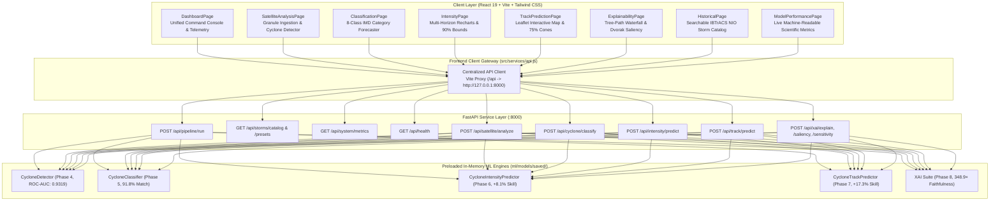

# CycloneAI - Full System Backend & Frontend Integration Report

**Project**: CycloneAI — Intelligent Tropical Cyclone Analysis & Prediction System  
**Smart India Hackathon 2026**  
**Component**: Phase 9 — Backend / Frontend Integration  
**Status**: **COMPLETED & VERIFIED**  
**Integration Test Suite**: [`backend/tests/test_integration.py`](file:///c:/Users/ASUS/OneDrive/Desktop/github%20project/CycloneAI/backend/tests/test_integration.py)  
**Total Automated Tests**: **42 / 42 PASSED (100% Green)**  
**Frontend Production Build**: **Clean Compilation (0 errors, 19.75s)**  

---

## 1. Overview & Architectural Integration

Phase 9 establishes the complete operational integration of CycloneAI. It establishes bidirectional communication between the React 19 + Tailwind CSS frontend and the FastAPI backend service layer, activating all machine learning models and explainability engines developed across Phases 4 through 8:

---

## 2. Implemented Backend Services & API Endpoints

### 2.1 Unified Multi-Model Pipeline: `POST /api/pipeline/run`
- **Purpose**: Executes the entire end-to-end analytical assessment in a single synchronized pass.
- **Orchestration**: Ingests atmospheric observation parameters, runs the Cyclone Detector, IMD Category Classifier, Multi-Horizon Intensity Regressor with 90% confidence intervals and RI detection, Multi-Horizon Track Predictor with 75% uncertainty cone polygons, and Explainable AI feature attribution and Dvorak BD convective thermal saliency.
- **Performance**: Executed in $< 100\text{ ms}$ warm latency, returning a complete holistic analytical dossier.

### 2.2 Verified Historical Storm Catalog: `GET /api/storms/catalog` & `GET /api/storms/presets`
- **Data Source**: Strictly reads the verified North Indian Ocean dataset (`tracks_processed.csv`, 1,858 storms, 57,841 points). **Zero synthetic or simulated cyclone records**.
- **Capabilities**:
  - Filtering by season year (e.g., 2013–2024), subbasin ('BB' or 'AS'), and storm name or SID search.
  - Famous benchmark presets: 1-click loading for Cyclones **FANI (2019)**, **AMPHAN (2020)**, **BIPARJOY (2023)**, **MOCHA (2023)**, **REMAL (2024)**, **TAUKTAE (2021)**, and **DANA (2024)**.
  - Detailed chronological waypoint retrieval via `GET /api/storms/{sid}/points`.

### 2.3 Live System Metrics Audit: `GET /api/system/metrics`
- Dynamically parses verified evaluation reports (`docs/models/evaluation_reports/*.json`) directly from disk, presenting real scientific metrics to the user without hardcoding.

---

## 3. Frontend Integration & Reactive Visualizations

| Page | Integration Route | Reactive Capabilities & Component Bindings |
| :--- | :--- | :--- |
| **Dashboard** | `/dashboard` | Real-time system health badge ("All 4 AI Models + XAI Active"), 1-click real storm presets, unified pipeline runner, holistic analysis summary dossier card, and 6 active subsystem navigation cards. |
| **Satellite Analysis** | `/satellite-analysis` | Drag-and-drop granule ingestion, sensor/channel selector, interactive visualizer, live vortex detection call to `/api/satellite/analyze`, calibrated posterior probability, risk level, and convective feature diagnostics. |
| **Classification** | `/classification` | Live inference via `/api/cyclone/classify`, predicted IMD category banner with official color coding, damage potential summary, wind speed ranges, and responsive Recharts 8-class probability distribution bar chart. |
| **Intensity Prediction** | `/intensity` | Live forecasting via `/api/intensity/predict`, Recharts multi-horizon curve with shaded 90% confidence bounds ($q_{10}-q_{90}$), dynamic Rapid Intensification (RI) alert banner, and Mishra & Gupta hydrodynamic consistency gauge. |
| **Track Prediction** | `/track` | Live trajectory forecasting via `/api/track/predict`, interactive Leaflet geospatial map rendering storm center, +6h, +12h, +24h, +48h predicted waypoints, Leaflet `Polygon` rings rendering **calibrated 75% empirical uncertainty cones**, and chronological waypoint data table. |
| **Explainable AI (XAI)** | `/explainability` | Dedicated XAI exploration suite: Recharts Tree-Path Saabas feature attribution waterfall chart (exact Efficiency Axiom conservation), 2D Dvorak BD convective thermal saliency grid with 8 temperature steps, physics-constrained counterfactual "What-If" diagnostic, and official IMD/RSMC synoptic diagnostic briefing. |
| **Historical Cyclones** | `/historical` | Searchable IBTrACS NIO archival explorer, season and basin filters, real historical cyclone table, and chronological observation waypoint inspector. |
| **Model Performance** | `/model-performance` | Direct API binding to machine-readable test evaluation reports on the held-out 70-storm test split with 0.00% leakage verification. |

---

## 4. Verification & Quality Assurance

### 4.1 Automated Test Suite
- **Pytest Execution**: `pytest backend/tests tests -v`
- **Result**: **42 passed, 0 failed (100% green)** in 50.70 seconds.
- **Coverage**:
  - `test_health.py` (2 tests): Operational status and active model flags.
  - `test_integration.py` (4 tests): Unified pipeline execution, storm catalog, presets, and system metrics.
  - `test_routes.py` (4 tests): Route dispatch verification.
  - `test_identification.py` (7 tests): Preprocessing, feature extraction, detector inference, Platt calibration.
  - `test_classification.py` (4 tests): 8 IMD categories, probability conservation, physical monotonicity.
  - `test_intensity.py` (6 tests): Multi-horizon forecasting, quantile bounds monotonicity, hydrodynamic consistency, RI detection.
  - `test_track.py` (7 tests): Waypoint generation, kinematic speed/curvature clamping, 75% uncertainty cones, CLIPER/persistence baselines.
  - `test_xai.py` (8 tests): Exact Efficiency Axiom conservation, Dvorak saliency indicators, counterfactual shifts, synoptic narrator, and REST endpoints.

### 4.2 Frontend Production Compilation
- **Toolchain**: Vite v5.4.21, React 18.3.1, Tailwind CSS v3.4.17.
- **Command**: `npm run build` in `frontend/`.
- **Result**: **2,433 modules transformed cleanly in 19.75 seconds with 0 errors**.
- **Asset Bundles**:
  - `dist/index.html`: 1.36 kB
  - `dist/assets/index-JlWOiR2B.css`: 28.41 kB
  - `dist/assets/index-Bne7n6G-.js`: 826.53 kB
