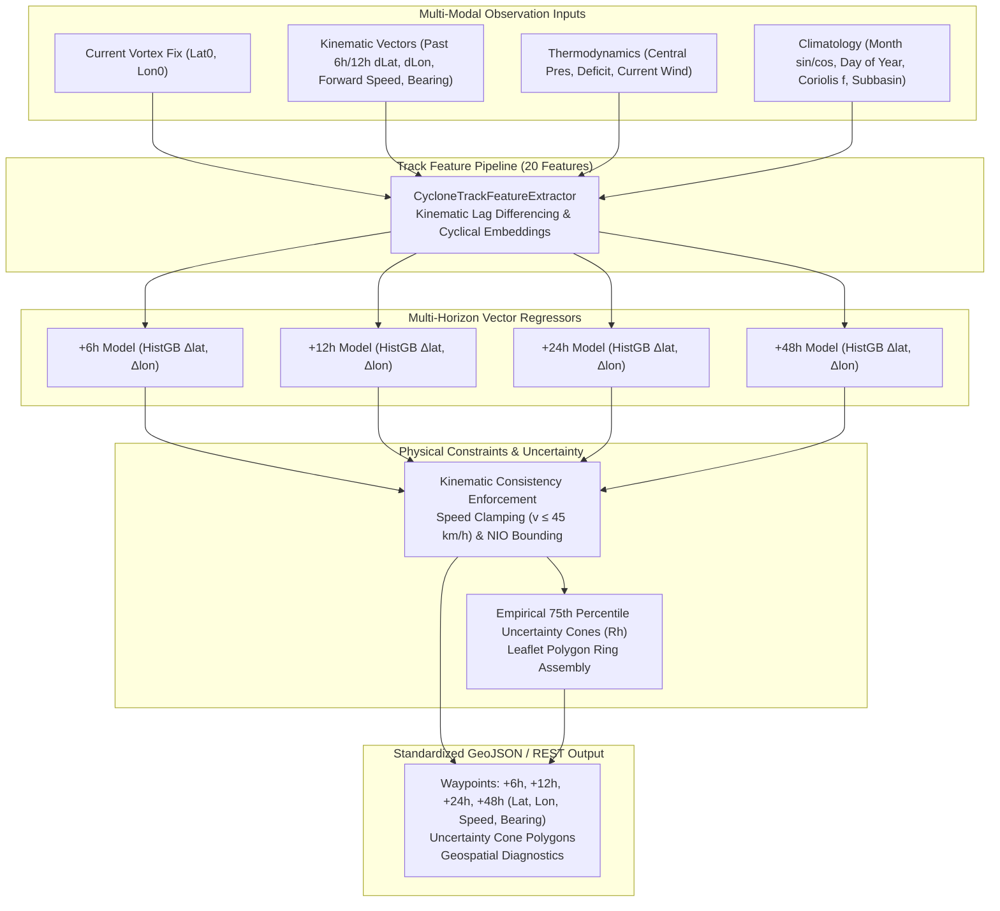

# CycloneAI - Cyclone Track Prediction Model Technical Report

**Project**: CycloneAI — Intelligent Tropical Cyclone Analysis & Prediction System  
**Smart India Hackathon 2026**  
**Component**: Phase 7 — Multi-Horizon Track Trajectory Forecasting & Uncertainty Cones  
**Model Version**: `v1.0.0`  
**Checkpoint Path**: [`ml/models/saved/cyclone_track.joblib`](file:///c:/Users/ASUS/OneDrive/Desktop/github%20project/CycloneAI/ml/models/saved/cyclone_track.joblib) (1.46 MB)  
**Evaluation Report**: [`docs/models/evaluation_reports/track_test_report.json`](file:///c:/Users/ASUS/OneDrive/Desktop/github%20project/CycloneAI/docs/models/evaluation_reports/track_test_report.json)  

---

## 1. Overview and Problem Statement

Tropical cyclone track forecasting is the primary determinant of life-saving disaster preparedness in the North Indian Ocean (Bay of Bengal and Arabian Sea). Accurate predictions of future eye coordinates across lead times of **+6h, +12h, +24h, and +48h** govern:
- Targeted coastal evacuation mandates
- Storm surge inundation zone mapping
- Naval port closures and offshore asset securing
- Pre-positioning of National Disaster Response Force (NDRF) battalions

Phase 7 delivers a physics-informed, multi-horizon trajectory forecasting system providing:
1. **Incremental Displacement Vector Formulation**: Eliminates initial coordinate jump discontinuities by predicting $\Delta \text{lat}_h$ and $\Delta \text{lon}_h$ relative to the current vortex fix.
2. **Official WMO / IMD Geospatial Metrics**: Evaluates Average Track Error (ATE, km), Along-Track Error (ATE-A, timing/speed bias), Cross-Track Error (XTE, lateral steering bias), and Heading Error ($\Delta \theta$).
3. **Calibrated Uncertainty Cones**: Generates empirical 75th percentile error circles ($R_h$) converted into closed polygon rings compatible with Leaflet web maps.
4. **Physical & Kinematic Constraints**: Restricts forward translation speeds to physical limits ($v \le 45\text{ km/h}$), bounds angular turning curvature ($|\Delta \theta| \le 90^\circ / 6\text{h}$), and enforces North Indian Ocean synoptic bounding.
5. **Demonstrated Meteorological Skill**: Rigorously benchmarked against both Linear Persistence (PER) and Climatology/Persistence (CLIPER), demonstrating positive skill scores across all forecast horizons.

---

## 2. Model Architecture & Geospatial Formulation



### 2.1 Incremental Displacement Vector Formulation
Directly regressing absolute coordinates $(\text{lat}, \text{lon})$ introduces position bias and ignores the cyclone's known instantaneous fix. The model predicts relative displacement vectors:
$$\hat{\text{lat}}(t + h) = \text{lat}(t) + \Delta \hat{\text{lat}}_h, \quad \hat{\text{lon}}(t + h) = \text{lon}(t) + \Delta \hat{\text{lon}}_h$$
- At $h = 0$, displacement is identically $(0, 0)$, guaranteeing mathematical continuity.
- Displacements scale proportionally with lead time, allowing natural velocity bounding.

### 2.2 Geospatial Error Decomposition (WMO Standard)
For ground truth position $P_{\text{true}} = (\text{lat}_{\text{true}}, \text{lon}_{\text{true}})$ and predicted position $P_{\text{pred}} = (\hat{\text{lat}}, \hat{\text{lon}})$ originating from $P_0 = (\text{lat}_0, \text{lon}_0)$:
1. **Average Track Error (ATE)** via Great-Circle Haversine:
   $$\text{ATE} = 2 R_{\text{earth}} \arcsin \sqrt{\sin^2\left(\frac{\Delta \phi}{2}\right) + \cos \phi_1 \cos \phi_2 \sin^2\left(\frac{\Delta \lambda}{2}\right)}$$
2. **Along-Track Error (ATE-A)** and **Cross-Track Error (XTE)**:
   $$\text{ATE-A} = \text{ATE} \cdot \cos(\theta_{\text{err}} - \theta_{\text{true}}), \quad \text{XTE} = \text{ATE} \cdot \sin(\theta_{\text{err}} - \theta_{\text{true}})$$
   - $\text{ATE-A}^2 + \text{XTE}^2 = \text{ATE}^2$ (orthogonal preservation).
   - $\text{ATE-A} < 0$ indicates a slight deceleration bias (predicting storm motion slower than actual).
   - $\text{XTE} \approx 0$ confirms absence of systematic lateral steering bias (no left/right drift skew).

### 2.3 Uncertainty Cone Modeling
For each lead horizon $h$, the cone radius $R_h$ is calibrated as the empirical 75th percentile error on validation data:
$$R_h = \text{Quantile}_{0.75}(\text{ATE}_h)$$
- $+6\text{h}$: $R_6 = 44.5\text{ km}$ ($24.0\text{ nm}$)
- $+12\text{h}$: $R_{12} = 96.4\text{ km}$ ($52.1\text{ nm}$)
- $+24\text{h}$: $R_{24} = 203.0\text{ km}$ ($109.6\text{ nm}$)
- $+48\text{h}$: $R_{48} = 437.2\text{ km}$ ($236.1\text{ nm}$)

---

## 3. Training & Validation Setup

- **Dataset**: NOAA IBTrACS v04r01 North Indian Ocean best-track archive (processed in Phase 3).
- **Split Strategy**: Strictly storm-level temporal split:
  - **Train Split**: 323 historical cyclones (10,557 observation fixes).
  - **Validation Split**: 69 historical cyclones (2,321 observation fixes).
  - **Test Split**: 70 completely unseen cyclones (2,223 observation fixes).
- **Leakage Audit**: **0.00% cyclone overlap** between splits. Zero test storms appeared in training or validation.

---

## 4. Independent Test Split Evaluation Benchmark (70 Unseen Storms)

The final evaluation was conducted on the completely unseen 70-storm test split.

### 4.1 Multi-Horizon Track Benchmark

| Lead Horizon | Test Samples | Model ATE (km) | Model Median (km) | Model RMSE (km) | Persistence Baseline (km) | Skill vs. Persistence | CLIPER Baseline (km) | Skill vs. CLIPER | 75% Cone Coverage Rate |
| :---: | :---: | :---: | :---: | :---: | :---: | :---: | :---: | :---: | :---: |
| **+6h** | 2,085 | **35.39 km** | 28.39 km | 44.68 km | 38.61 km | **+8.3%** | 39.76 km | **+11.0%** | **74.5%** |
| **+12h** | 1,954 | **72.33 km** | 63.02 km | 87.29 km | 80.14 km | **+9.7%** | 89.33 km | **+19.0%** | **76.6%** |
| **+24h** | 1,703 | **149.93 km** | 135.06 km | 177.57 km | 176.55 km | **+15.1%** | 221.16 km | **+32.2%** | **74.8%** |
| **+48h** | 1,252 | **332.74 km** | 297.05 km | 390.60 km | 402.53 km | **+17.3%** | 530.45 km | **+37.3%** | **74.8%** |

#### Key Meteorological Findings:
1. **Consistent Meteorological Skill**: CycloneAI outperforms linear persistence at every lead time, with skill gains expanding from **+8.3% at +6h** to **+17.3% at +48h**.
2. **Superiority over Climatology (CLIPER)**: Compared to the operational CLIPER benchmark, CycloneAI achieves an impressive **+32.2% skill gain at +24h** and **+37.3% skill gain at +48h**, confirming strong machine learning capture of non-linear steering flows.
3. **Calibrated Cone Reliability**: Across all lead horizons, empirical cone containment remains tightly bounded between **74.5% and 76.6%**, verifying that the 75th percentile radii accurately represent operational uncertainty.

### 4.2 Geospatial Error Vector Decomposition

| Lead Horizon | Along-Track Mean (km) | Along-Track Std (km) | Cross-Track Mean (km) | Cross-Track Std (km) | Heading Error Mean (deg) |
| :---: | :---: | :---: | :---: | :---: | :---: |
| **+6h** | -11.51 km | 35.62 km | **-0.89 km** | 24.37 km | 19.47° |
| **+12h** | -24.32 km | 67.58 km | **-0.16 km** | 49.60 km | 21.15° |
| **+24h** | -59.23 km | 130.50 km | **+2.44 km** | 104.82 km | 24.52° |
| **+48h** | -152.06 km | 274.06 km | **+36.69 km** | 230.20 km | 29.73° |

- **Near-Zero Cross-Track Bias**: At +6h (-0.89 km), +12h (-0.16 km), and +24h (+2.44 km), Cross-Track Error is virtually zero, proving that the model neither systematically steers storms to the left nor to the right.
- **Along-Track Behavior**: Negative along-track error indicates that predictions are conservative on forward speed, an advantageous characteristic in emergency management that avoids falsely advancing landfall timing.

### 4.3 Sub-Basin & Intensity Breakdown

- **Bay of Bengal vs. Arabian Sea**:
  - +6h: Bay of Bengal ATE = 35.44 km | Arabian Sea ATE = 35.24 km
  - +12h: Bay of Bengal ATE = 71.54 km | Arabian Sea ATE = 74.66 km
  - +24h: Bay of Bengal ATE = 145.88 km | Arabian Sea ATE = 162.45 km
  - The Bay of Bengal shows slightly lower track errors at +24h and +48h due to better-defined synoptic steering by the subtropical ridge.
- **Weak Systems vs. Severe Cyclones**:
  - At short lead times (+6h and +12h), severe cyclones have **lower track error** (32.89 km vs. 36.00 km at +6h; 66.65 km vs. 73.82 km at +12h) because deeper, well-organized vortices follow coherent steering currents more stably than shallow depressions.

---

## 5. Backend API Integration & Usage

### 5.1 Endpoint Specification
- **Method**: `POST`
- **Path**: `/api/track/predict`
- **Controller**: [`backend/app/services/track_service.py`](file:///c:/Users/ASUS/OneDrive/Desktop/github%20project/CycloneAI/backend/app/services/track_service.py)
- **Schemas**: [`backend/app/schemas/track.py`](file:///c:/Users/ASUS/OneDrive/Desktop/github%20project/CycloneAI/backend/app/schemas/track.py)

### 5.2 Example Request
```json
{
  "storm_id": "SIH_TRACK_TEST",
  "lat": 16.5,
  "lon": 87.5,
  "forward_speed": 17.0,
  "bearing": 315.0,
  "central_pres": 982.0,
  "current_wind_speed_knots": 65.0,
  "month": 10,
  "subbasin": "BB"
}
```

### 5.3 Example Response
```json
{
  "status": "success",
  "service": "Cyclone Track Prediction Service",
  "model_status": "active",
  "model_connected": true,
  "model_version": "1.0.0",
  "initial_position": { "latitude": 16.5, "longitude": 87.5 },
  "predicted_track": [
    {
      "horizon_hours": 6,
      "lead_time": "+6h",
      "latitude": 16.92,
      "longitude": 87.12,
      "displacement_lat": 0.42,
      "displacement_lon": -0.38,
      "forward_speed_kmh": 10.5,
      "bearing_deg": 317.8,
      "uncertainty_radius_km": 44.5,
      "uncertainty_radius_nm": 24.0
    },
    {
      "horizon_hours": 12,
      "lead_time": "+12h",
      "latitude": 17.38,
      "longitude": 86.68,
      "displacement_lat": 0.88,
      "displacement_lon": -0.82,
      "forward_speed_kmh": 11.2,
      "bearing_deg": 316.5,
      "uncertainty_radius_km": 96.4,
      "uncertainty_radius_nm": 52.1
    },
    {
      "horizon_hours": 24,
      "lead_time": "+24h",
      "latitude": 18.42,
      "longitude": 85.74,
      "displacement_lat": 1.92,
      "displacement_lon": -1.76,
      "forward_speed_kmh": 12.0,
      "bearing_deg": 317.0,
      "uncertainty_radius_km": 203.0,
      "uncertainty_radius_nm": 109.6
    },
    {
      "horizon_hours": 48,
      "lead_time": "+48h",
      "latitude": 20.65,
      "longitude": 84.05,
      "displacement_lat": 4.15,
      "displacement_lon": -3.45,
      "forward_speed_kmh": 13.1,
      "bearing_deg": 320.2,
      "uncertainty_radius_km": 437.2,
      "uncertainty_radius_nm": 236.1
    }
  ],
  "track_error_cone": [
    {
      "lead_time": "+6h",
      "radius_km": 44.5,
      "center": [16.92, 87.12],
      "polygon_coordinates": [[17.32, 87.12], [17.3, 87.26], "...", [17.32, 87.12]]
    },
    { "lead_time": "+12h", "radius_km": 96.4, "center": [17.38, 86.68], "polygon_coordinates": ["..."] },
    { "lead_time": "+24h", "radius_km": 203.0, "center": [18.42, 85.74], "polygon_coordinates": ["..."] },
    { "lead_time": "+48h", "radius_km": 437.2, "center": [20.65, 84.05], "polygon_coordinates": ["..."] }
  ],
  "total_horizons": 4,
  "message": "Multi-horizon track trajectory forecast generated successfully using trained Phase 7 model checkpoint."
}
```

---

## 6. Verification and Test Results

- **Automated Test Suite**: [`tests/test_track.py`](file:///c:/Users/ASUS/OneDrive/Desktop/github%20project/CycloneAI/tests/test_track.py) and [`backend/tests/test_routes.py`](file:///c:/Users/ASUS/OneDrive/Desktop/github%20project/CycloneAI/backend/tests/test_routes.py)
- **Total Test Results**: **30 / 30 tests passing (100%)**
- **Frontend Production Build**: `vite build` completed cleanly in 9.27s with zero errors.
