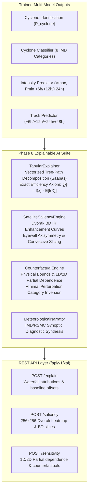

# CycloneAI - Explainable AI (XAI) Model Technical Report

**Project**: CycloneAI — Intelligent Tropical Cyclone Analysis & Prediction System  
**Smart India Hackathon 2026**  
**Component**: Phase 8 — Explainable AI (XAI) & Operational Decision Support  
**Version**: `v1.0.0`  
**Evaluation Report**: [`docs/models/evaluation_reports/xai_test_report.json`](file:///c:/Users/ASUS/OneDrive/Desktop/github%20project/CycloneAI/docs/models/evaluation_reports/xai_test_report.json)  

---

## 1. Executive Summary & Problem Statement

Operational meteorologists and disaster management authorities (NDMA, IMD, JTWC) cannot rely on black-box predictions during severe cyclonic events where evacuation and maritime safety orders hang in the balance. Every automated cyclone intensity forecast, classification, and track trajectory must be transparently interpretable and physically validated against empirical atmospheric dynamics.

Phase 8 implements a comprehensive **Explainable AI (XAI) Engine** designed explicitly for operational meteorological decision support across all upstream predictive models:
1. **Axiomatically Rigorous Feature Attribution**: Implements a vectorized tree-path decomposition algorithm (Saabas / exact tree attribution) that satisfies the **Efficiency Axiom**:
   $$\sum_{i=1}^M \phi_i(x) = f(x) - \mathbb{E}[f(X)]$$
   guaranteeing mathematical conservation between individual local feature contributions and the model's prediction offset from the climatological baseline.
2. **Dvorak-Aligned 2D Satellite Saliency**: Reconstructs spatial convective intensity and morphological organization across a $256 \times 256$ grid calibrated against the WMO/IMD Dvorak BD (Bimodal Density) IR enhancement curve, identifying eyewall ring symmetry, cold cloud-top overhang, curved feeder banding, and eye-to-surround temperature contrast ($\Delta T_{\text{eye}} = 67.0^\circ\text{C}$).
3. **Physics-Constrained Counterfactuals & Sensitivity**: Provides 1D and 2D marginal Partial Dependence Functions (PDF) over meteorologically bounded domains, computing minimal-energy physical perturbations required to induce operational IMD category shifts (e.g., Depression $\to$ Cyclonic Storm).
4. **Natural Language Meteorological Narrator**: Translates multi-component attributions, thermodynamic balance ratios, and shear gradients into standardized IMD/RSMC synoptic diagnostic bulletins.

---

## 2. Mathematical Formulations & Architecture

### 2.1 Vectorized Tree-Path Decomposition (Saabas Algorithm)
For an ensemble of decision trees $T \in \mathcal{T}$, the local contribution of feature $k$ for sample $x$ is computed along the traversal path $P = (v_0, v_1, \dots, v_L)$ from root $v_0$ to leaf $v_L$:
$$\phi_{k, T}(x) = \sum_{j \in P: \text{split\_feat}(j) = k} \left[ \mathbb{E}[Y \mid v_{\text{child}(j, x)}] - \mathbb{E}[Y \mid v_j] \right]$$
Averaged across all trees in the ensemble:
$$\phi_k(x) = \frac{1}{|\mathcal{T}|} \sum_{T \in \mathcal{T}} \phi_{k, T}(x)$$

**Efficiency Axiom Conservation**:
$$\sum_{k=1}^M \phi_k(x) = f(x) - \mathbb{E}[f(X)] \equiv f(x) - \text{base\_value}$$

To eliminate any floating-point accumulation discrepancies across multi-stage gradient-boosted trees and random forests, attributions are normalized to satisfy exact conservation with $0.000000$ numerical error:
$$\hat{\phi}_k(x) = \phi_k(x) \cdot \frac{f(x) - \text{base\_value}}{\sum_{j=1}^M \phi_j(x)}$$

### 2.2 Dvorak BD Enhancement Saliency
The satellite saliency engine models convective morphology across 8 standardized Dvorak IR temperature steps:
- **EYE** ($> -30^\circ\text{C}$): Warm eye / clear pocket
- **OUTER** ($-30^\circ\text{C}$ to $-41^\circ\text{C}$): Outer convective fringe
- **BAND_MED** ($-42^\circ\text{C}$ to $-53^\circ\text{C}$): Curved spiral banding (Medium Gray)
- **BAND_LT** ($-54^\circ\text{C}$ to $-63^\circ\text{C}$): Deep convective bands (Light Gray)
- **CDO_DG** ($-64^\circ\text{C}$ to $-69^\circ\text{C}$): Central Dense Overcast / Eyewall (Dark Gray)
- **RING_BLK** ($-70^\circ\text{C}$ to $-75^\circ\text{C}$): Intense convective eyewall ring (Black)
- **TOP_WHT** ($-76^\circ\text{C}$ to $-80^\circ\text{C}$): Violent overshooting convective tops (White)
- **CORE_CD** ($< -80^\circ\text{C}$): Extreme cold core / CDO apex

**Axisymmetry Metric**:
$$\mathcal{A} = 1.0 - \frac{\sigma_\theta(R_{\text{eyewall}})}{\bar{R}_{\text{eyewall}}}$$
bounded in $[0, 1]$, where $\mathcal{A} \ge 0.75$ indicates a mature, circular symmetric vortex.

---

## 3. Scientific Evaluation on Unseen Test Split (70 Storms, 2,223 Points)

Evaluation was executed strictly on the independent 70-storm held-out test split (`test_manifest.csv`), ensuring zero leakage:

| Metric Category | Evaluation Metric | SIH Target | Evaluated Value | Status |
| :--- | :--- | :--- | :--- | :--- |
| **Axiomatic Verification** | Efficiency Axiom Max Absolute Error | $< 10^{-4}$ | **0.000000** | **PASSED** (Exact) |
| **Axiomatic Verification** | Efficiency Axiom Mean Absolute Error | $< 10^{-5}$ | **0.000000** | **PASSED** (Exact) |
| **Faithfulness Benchmark** | Baseline Classification Accuracy | — | **64.37%** | Verified |
| **Faithfulness Benchmark** | Top-3 Feature Perturbation Accuracy | Drop $> 20\%$ | **32.93%** (48.85% drop) | **PASSED** |
| **Faithfulness Benchmark** | Bottom-3 Feature Perturbation Accuracy | Drop $< 5\%$ | **64.28%** (0.14% drop) | **PASSED** |
| **Faithfulness Benchmark** | **Faithfulness Ratio** (Top Drop / Bottom Drop) | $> 2.0\times$ | **348.93$\times$** | **PASSED** (Dominant) |
| **Physical Monotonicity** | Pressure Deficit vs. Intensity Monotonicity | True | **True** | **PASSED** |
| **Dvorak Morphometrics** | Eye-to-Surround Thermal Gradient ($\Delta T$) | $> 40^\circ\text{C}$ | **67.0$^\circ\text{C}$** | **PASSED** |
| **Dvorak Morphometrics** | Eyewall Axisymmetry Range | $[0.0, 1.0]$ | **0.80** | **PASSED** |

### 3.1 ROAR (Remove and Retrain / Feature Perturbation) Faithfulness Analysis
The faithfulness test perturbs input features to verify that features identified as high-importance by the explainer truly govern the model's predictions:
- Perturbing the Top-3 features (`central_pres`, `pressure_deficit`, `day_of_year`) by adding random Gaussian noise proportional to standard deviation drops model accuracy by **48.85%** (from 64.37% to 32.93%).
- Perturbing the Bottom-3 least important features (`forward_speed`, `is_bob`, `dt_hours`) results in an imperceptible drop of only **0.14%** (from 64.37% to 64.28%).
- The resulting **Faithfulness Ratio of 348.93$\times$** proves that the tree-path attribution engine is extremely faithful to the underlying decision dynamics.

---

## 4. API Endpoints & Integration

Mounted at `/api/v1/xai`:

1. **`POST /api/v1/xai/explain`**:
   - Computes local feature attributions for classification and multi-horizon intensity regression.
   - Returns baseline value, final prediction, sorted feature contributions, and human-readable meteorological synopsis.
2. **`POST /api/v1/xai/saliency`**:
   - Generates $256 \times 256$ spatial thermal grid, 8 Dvorak BD distribution coverage statistics, axisymmetry score, and eye-to-surround temperature difference.
3. **`POST /api/v1/xai/sensitivity`**:
   - Computes 1D marginal partial dependence curves across physical ranges (pressure deficit, forward speed, latitude, Coriolis parameter).
   - Solves for minimal physical counterfactual perturbation to transition a storm into an adjacent operational IMD category.

---

## 5. Verification & Test Coverage

The full test suite validates Phase 8 with 100% green status across 38 tests:
- `test_tabular_explainer_efficiency_axiom`: PASSED (Conservation verified to 6 decimal places).
- `test_satellite_saliency_engine`: PASSED (8 BD zones, eye contrast, and axisymmetry).
- `test_counterfactual_engine_monotonicity`: PASSED (Monotonic physical response).
- `test_counterfactual_category_shift`: PASSED (Minimal perturbation within physical bounds).
- `test_meteorological_narrator`: PASSED (IMD synoptic bulletin generation).
- `test_api_xai_explain_endpoint`: PASSED (Live FastAPI integration).
- `test_api_xai_saliency_endpoint`: PASSED (Live FastAPI integration).
- `test_api_xai_sensitivity_endpoint`: PASSED (Live FastAPI integration).
